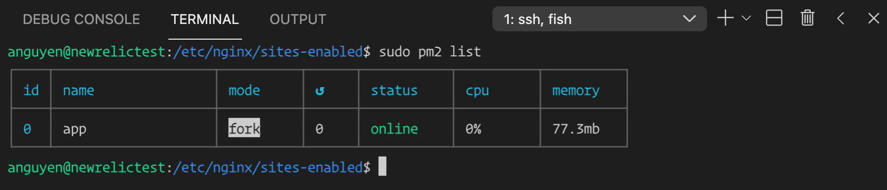
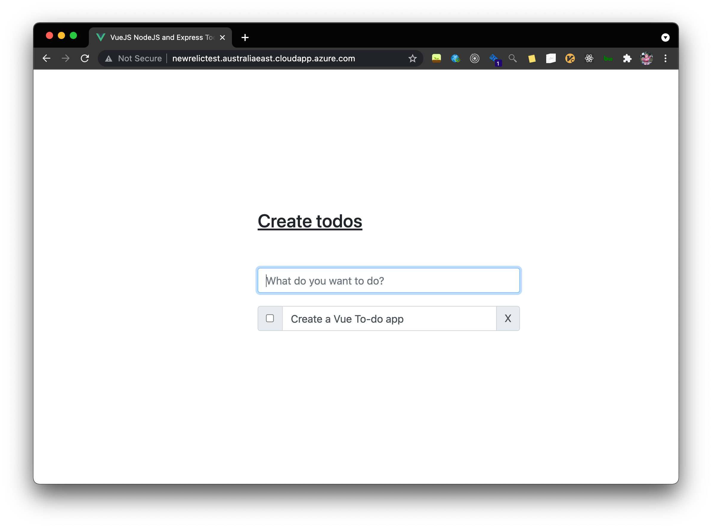

# Step 1: Setup environment
- create new linux VM on Azure 
- enable DNS: newrelictest.australiaeast.cloudapp.azure.com
- enable port 80 and port 88
- connect via SSH `ssh USERNAME@newrelictest.australiaeast.cloudapp.azure.com`

# Step 2: Create New Relic One Account

# Setup 3: stand-up a web application
- install nodejs, mongoDb, Nginx, pm2
- clone Simple Todo App: https://github.com/abiodunjames/NodeJs-Todo-List.git
- start backend using pm2 by running `pm2 start app.js` (inside the `backend` folder)

- backend can be accessed via `http://newrelictest.australiaeast.cloudapp.azure.com:88/todos/`
- run prod build of frontend and copy to `/var/todoapp` folder 
- update `/etc/nginx/sites-enabled/default` file and set root to point to `/var/todoapp`
- ui can be accessed via `http://newrelictest.australiaeast.cloudapp.azure.com`
