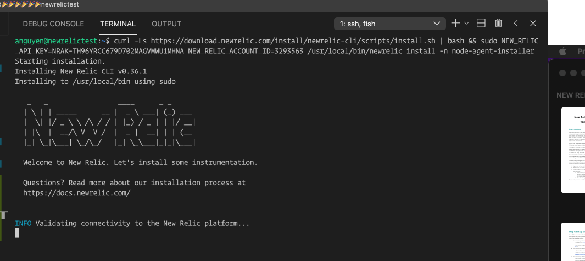

# Step 1: Setup environment
- create new linux VM on Azure 
- enable DNS: newrelictest.australiaeast.cloudapp.azure.com
- enable port 80 and port 8080
- connected via SSH `ssh USERNAME@newrelictest.australiaeast.cloudapp.azure.com` ✅

# Step 2: Create New Relic One Account

# Setup 3: stand-up a web application
- install nodejs, mongoDb, Nginx, pm2
- deploy simle Ecommerce app (nodeJS + React): https://github.com/dhatGuy/PERN-Store
- start backend using `pm2` by running `pm2 start index.js` (inside the `server` folder)

- backend can be accessed via `http://newrelictest.australiaeast.cloudapp.azure.com:8080/api/products` ✅
- run prod build of frontend and copy to `/var/pernstore` folder 
- update `/etc/nginx/sites-enabled/default` file and set root to point to `/var/pernstore`
- ui can be accessed via `http://newrelictest.australiaeast.cloudapp.azure.com` ✅

# Setup 4: Install New Relic Agents

## Install APM NodeJs Language Agent
- APM language agent => hook directly to the runtime of the backend code (in our case, it is ExpressJS backend API) and enable end to end transaction tracing (ExpressJS REST api route => Repository => MongoDB)
- install NodeJS APM Language Agent

- using provided instructions not working ❌

- manual installation worked ✅

## Install Postgres Infrastructure Agent
- works ✅

## Install NgInx Infrastructure Agent
- see data on connection and client requests
- not working ❌

## Install Browser Agent
- works ✅

### Question: What are the main differences between the various agents and integrations?
- APM language agent allows developers to drill down to the code level. 

- Depending on language type, you either have to add couple of line of codes (e.g. nodejs) or you don't have to (e.g. .NET)
- With New Relic Infrastructure Agent, we can collect stats from all external infrastructure services our app relies on, such as Database, Apache, Queue, External services (S3) and create a dashboard like this

###  Question: Is there any difference between the value provided by each agent? How would you quantify it? How would apply a value weight in % and how would you distribute it across the types of agents (% adding up to 100)? [Ex. 25% Application, 25% Infra, etc... = 100%]
- it depends on use cases, for a SaaS company which uses Cloud Native services (e.g. deploy using Azure App Service + Azure SQL or CosmosDB), they will want to spend more effort on Application and Browser Metrics. On the other side of the scale, if you maintain legacy applications that run on Virtual machines on your own data center, then the focus might be a lot more on the Infrastructure. 

###  Question: Most cloud providers give you access to cloud metrics already. Why would you bring the same data into New Relic?
- Unless your application is Greenfield and Cloud Native (using 100% all PaaS from Azure or AWS), without a single source of truth like NewRelic, it will be very hard to have a consistent interface where user can view/query all data related to your applicaiton

###  Question: For each of the above types of agents, list 3 of the top metrics that you think are the most valuable and to whom.
- Application: Apdex Score, Throughput, Error Rate
- Infrastructure: Memory Usage, CPU Utilization, GC
- Browser: first contentful paint, time to interactive, javascript errors
