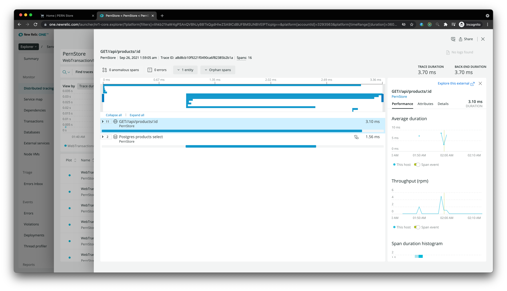

# Step 1: Setup environment
- create new linux VM on Azure 
- enable DNS: newrelictest.australiaeast.cloudapp.azure.com
- enable port 80 and port 8080
- connected via SSH `ssh USERNAME@newrelictest.australiaeast.cloudapp.azure.com` ✅

# Step 2: Create New Relic One Account


# Setup 3: stand-up a web application
- install nodejs, Postgres, Nginx, pm2
- deploy simle Ecommerce app (nodeJS + React): https://github.com/dhatGuy/PERN-Store
- start backend using `pm2` by running `pm2 start index.js` (inside the `server` folder)

- backend can be accessed via `http://newrelictest.australiaeast.cloudapp.azure.com:8080/api/products` ✅
- build frontend and copy to `/var/pernstore` folder 
- update `/etc/nginx/sites-enabled/default` file and set root to point to `/var/pernstore`
- ui can be accessed via `http://newrelictest.australiaeast.cloudapp.azure.com` ✅


# Setup 4: Install New Relic Agents

## Install APM NodeJs Language Agent
- APM language agent => hook directly to the runtime of the backend code (in our case, it is ExpressJS backend API) and enable end to end transaction tracing (ExpressJS REST api route => Repository => Postgres)
- install NodeJS APM Language Agent


- using provided instructions not working ❌

- manual installation worked ✅


## Install Postgres Infrastructure Agent


## Install NgInx Infrastructure Agent
- see data on connection and client requests
- not working ❌


## Install Browser Agent


### Question: What are the main differences between the various agents and integrations?
- APM language agent allows developers to drill down to the code level. 


- Depending on language type, you either have to add couple of line of codes (e.g. nodejs) or you don't have to (e.g. .NET)
- With New Relic Infrastructure Agent, we can collect stats from all external infrastructure services our app relies on, such as Database, Apache, Queue, External services (S3) and create a dashboard like this


###  Question: Is there any difference between the value provided by each agent? How would you quantify it? How would apply a value weight in % and how would you distribute it across the types of agents (% adding up to 100)? [Ex. 25% Application, 25% Infra, etc... = 100%]
- it depends on use cases, for a SaaS company which uses Cloud Native services (e.g. deploy using Azure App Service + Azure SQL or CosmosDB), they will want to spend more effort on Application and Browser Metrics. On the other side of the scale, if you maintain legacy applications that run on Virtual machines on your own data center, then the focus might be a lot more on the Infrastructure. 

###  Question: Most cloud providers give you access to cloud metrics already. Why would you bring the same data into New Relic?
- Unless your application is Greenfield and Cloud Native (using 100% all PaaS from Azure or AWS), without a single source of truth like NewRelic, it will be very hard to have a consistent interface where user can view/query all data related to your applicaiton

###  Question: For each of the above types of agents, list 3 of the top metrics that you think are the most valuable and to whom.
- Application: Apdex Score, Throughput, Error Rate
- Infrastructure: Memory Usage, CPU Utilization, GC
- Browser: first contentful paint, time to interactive, javascript errors

# Step 5: Apply Load to the Application
## add Simple Browser
- working ✅


## add Scripted API test
- working ✅

```javascript
 var assert = require('assert');
 $http.get('http://newrelictest.australiaeast.cloudapp.azure.com:8080/api/products/?page=1',
   // Callback
   function (err, response, body) {
     assert.equal(response.statusCode, 200, 'Expected a 200 OK response');
     assert.equal(body.length > 1, true, 'Expected to have more than 1');
   }
 );
```

## add Scripted Browser
- working ✅

```javascript
 var assert = require('assert');

$browser
	.get('http://newrelictest.australiaeast.cloudapp.azure.com/')
	.then(function () {
		return $browser
			.findElement($driver.By.css('button'))
			.click()
			.then(function () {
				return $browser.getCurrentUrl().then(function (url) {
					assert.equal(
						'http://newrelictest.australiaeast.cloudapp.azure.com/login',
						url,
						'Page not redirected to login'
					);
				});
			});
	});
```

### Question: What is the difference between Real User Monitoring (e.g. New Relic’s Browser agent) and a Synthetic check?
- Real User Monitor is done by injecting a Javascript into application, this JS send real user stats (e.g. first contentful paint, javascript errors) back to New Relic via Ajax calls.
- Synthetic check is used to ensure application up time, this can be done by sending fake API calls (using Scripted API) or use browser automation to perform some important user interaction with the web application (using Scripted Browser for SPA apps for example)

### Question: What are the benefits of Real User Monitoring over Synthetics and vice versa?
- Real User Monitoring:
  - how responsive is the app (intial load time)
  - is there any unhandled Javascript errors 
  - which devices users accessing the web app from (chrome/mobile...)
- Synthetics:
  - alert when system goes down (e.g. after deploy)
  - measure SLA 
  - keep systems warn before real user login (e.g for serverless apps)

### Question: If we were to run the exact same test pattern as a Real User and then as a Synthetic Script, would there be any difference between the two executions as observed within the New Relic Platform?
- from the networking point of view, there should be no difference between real user and Synthetic script requests, however when New Relic send the request, it added `x-newrelic-synthetics` header which it is used to identify which requests are from real user and which are not.


# Telemetry Data Platform
### Question: What is the difference between a Metric and an Event?
- both metrics and events are time series data, metrics are sampled at regular intervals (e.g. Avg memory usage of a vm), events are irregular and unpredictable (e.g. backend exceptions, user visits)

# Step 6: Import Logs
- logs for pm2 are stored at `~/.pm2/logs`
- added logs for Pern store (both error and normal) ✅


### Question: What’s the value of bringing logs into the New Relic One platform?
- Most common usecase is troubleshooting some exceptions in prod. With logs available in the same interface, user can see exactly what went wrong (using Stacktrace)


### Question: What additional information could you obtain from Logs that you couldn’t obtain using the other sources of data?
- App logs are written by developers and contains valuable context information which cannot be captured by other automated ways. For example, if we get 403 Forbidden from the backend API, APM language agent will not be able to tell the reason why user get 403 Forbidden, but if developers log the reason why in the log file then we can see this in New Relic.
- Another example is the information captured by Infrastucture agents like URL parameters (products/id) or JWT token is not as useful compared to the real product name (backend query database) and user role (from JWT token) which can be logged and captured by New Relic

### Question: Do you see an opportunity to build applications without the need to use logs? How would you approach the problem without losing visibility?
- Do you see an opportunity to build applications without the need to use logs ⭐️
- If we don't have applications logs


# Step 7:Import Traces
- Distributed Trace enabled and working ✅

